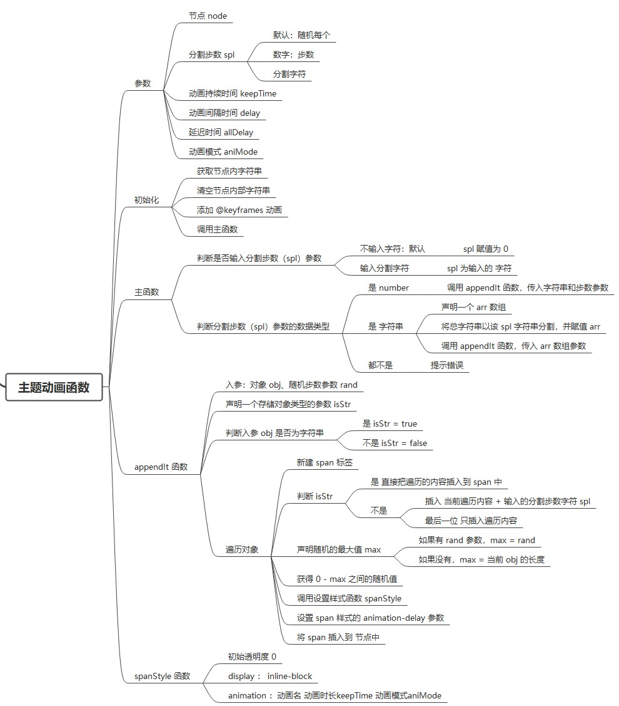

# 文字随机动画
#### 功能：将一个句子切分成若干个字符的组合，随机从下到上渐入动画

#### 原理：

 
# 快速上手
## 安装
```shell
npm install textani
```
## 全局注册（在 main.js 文件里注册）
```javascript
import TextAni from 'textani';
global.TextAni = TextAni;
```
## 局部注册（在你所使用的 vue 里注册）
```javascript
import TextAni from 'textani';
```
## 例子
文本动画
```html
<div class="title">
    <p class="text">梯田,弯,弯闪,银光。</p>
</div>
```
```javascript
new TextAni({
    node:'.text', //必填
    spl:0, //选填
    //默认 0，每个字符都有独立的动画
    //写入数字 比如 4，动画总共分为 4 步，4 步后全部字符显示，动画执行结束
    //写入分割字符 比如 ','，将以 ',' 字符后作为断点分割字符串，分别是独立的动画
    
    keepTime:'.8s',
    delay:'.3s',
    allDelay:'1s',
    aniMode:'ease-out',
});
```

# PS:一个前端界的小学生，勿喷 多指教