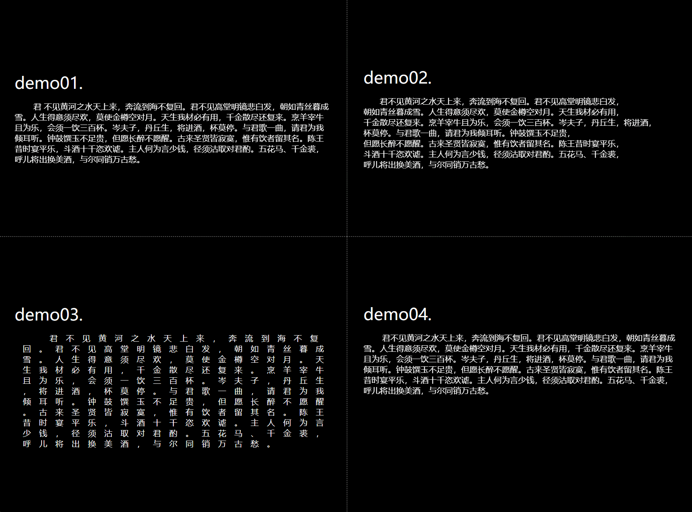

# <center>文字随机动画</center>



#### 介绍

- 功能：将一个句子切分成若干个字符的组合，随机从下到上渐入动画
- 原理：根据不同条件切分内容，然后使用 `span` 标签包裹，控制 `animation-delay` 属性控制偏移动画
- <details>
    <summary>技术点</summary>

  - 获取当前文档中的样式表：`document.styleSheets`

  - 向样式表中添加新的样式：`document.styleSheets[0].insertRule(内容, index)`

    - 注：必须当前文档的样式表中存在样式标签才行，否则需要自行添加 `style` 标签

    </details>

  

# 快速上手

使用链接引入和安装依赖包选用一种即可

## 一.可以使用连接引入

```shell
<script src="https://cdn.jsdelivr.net/gh/sonicexx/textAnimation@master/linkJS/textani.js"> </script>
```

### 直接使用实例化

```javascript
new TextAni({
  //API
});
```

## 二.安装依赖包

```shell
npm install textani
```

### 全局注册（在 main.js 文件里注册）

```javascript
import TextAni from 'textani';
global.TextAni = TextAni;
```

### 局部注册（在你所使用的 vue 里注册）

```javascript
import TextAni from 'textani';
```

### API

**<font color=red>重要<font>：为解决首帧原本内容闪烁，需要给动画元素添加一个其实 透明度为 0 的样式**

```css
.text {
  opacity: 0;
}
```

```javascript
new TextAni({
  el: '.text', //必填
  text:,//选填，指定所使用的文字内容
  spl: 0, //选填
  //默认 0，每个字符都有独立的动画
  //写入数字 比如 4，动画总共分为 4 步，4 步后全部字符显示，动画执行结束
  //写入分割字符 比如 ','，将以 ',' 字符后作为断点分割字符串，分别是独立的动画

  aniName: '自定义的动画名称', //选填
  //默认 透明度淡入动画

  keepTime: '1s', //选填
  //默认 1s，每个字符动画轨迹的时间

  delay: '1s', //选填
  //默认 1s，两个动画之间的间隔时间

  allDelay: '0s', //选填
  //默认 0s，整体动画的延迟时间

  aniMode: 'ease-in-out', //选填
  //默认：ease-in-out

  shuffle: true, //选填，选择动画是否按顺序淡入
  //默认：true
});
```

### 例子

#### 默认渐入动画：透明度渐入

```html
<div class="title">
  <p class="text">梯田,弯,弯闪,银光。</p>
</div>
```

```javascript
new TextAni({
  el: '.text',
});
```

#### 自定义渐入动画：自定义 @keyframes a{...}

```css
@keyframes a {
  0% {
    opacity: 0;
    transform: translateY(100%);
  }
  50% {
    transform: translateY(-10%);
    color: red;
  }
  100% {
    opacity: 1;
    transform: translateY(0);
  }
}
```

```html
<div class="title">
  <p class="text">梯田,弯,弯闪,银光。</p>
</div>
```

```javascript
new TextAni({
  el: '.text',
  spl: 0,
  aniName: 'a',
  keepTime: '.8s',
  delay: '.3s',
  aniMode: 'ease-out',
});
```

```
功能备注：目前还不支持有内嵌标签的情况
```

# PS:一个前端界的小学生，勿喷 多指教 😶
